# Messaging Meta Data Analysis

Student: Ernst Schwaiger

## Lab Environment

Für die Analyse der Datenpakete ohne TLS Interception wurde eine `Kali GNU/Linux Rolling VM`, Version `2025.4` unter VirtualBox `7.2.4 r170995 (Qt6.8.0 on windows)` verwendet.
Die Analyse der entschlüsselten Datenpakete erfolgte unter Windows 11 mithilfe von `mitmproxy V12.2.1`.

## Support

## Messaging Metadata Analysis

### Analysieren Sie eines der drei folgenden Messaging Protokolle bzw. Tools:
>Matrix (via Element Client)
>Signal
>WhatsApp
>Falls gewünscht ein anderes, nicht genanntes: in diesem Fall eine Email mit Begründung an Tobias Buchberger

**WhatsApp** wird im folgenden Analysiert werden

#### Architektur
>Welche Architektur ist umgesetzt (Centralized/Federated/Distributed)?

Sowohl die Signal App als auch WhatsApp basieren auf dem *Signal Protokoll*, das eine **zentrale** Architektur umsetzt, siehe "Real-World_Cryptography", Kapitel 10.4 "Secure messaging: A modern look at end-to-end encryption with Signal"

"[...]In 2010, the Signal mobile phone application (then called TextSecure) was released, making use of a newly created protocol called the Signal protocol. At the time, most secure communication protocols like PGP, S/MIME, and OTR were based on 
federated protocols, where no central entity was required for the network to work. The Signal mobile application largely departed from tradition by running a central service and offering a single official Signal client application. While Signal prevents interoperability with other servers, the Signal protocol is open standard and has been adopted by many other messaging applications including Google Allo (now defunct), WhatsApp, Facebook Messenger, Skype, and many others.[...]"

>Ist das Protokoll synchron oder asynchron?

Das verwendete *Signal Protokoll* ist **asynchron**, siehe "Real-World_Cryptography", Kapitel 10.4.2 "X3DH: the Signal protocol’s handshake"

"[...] Most secure messaging apps before Signal were synchronous. This meant that, for example, Alice wasn’t able to start (or continue) an end-to-end encrypted conversation with Bob if Bob was not online. The Signal protocol, on the other hand, is asynchronous (like email), meaning that Alice can start (and continue) a conversation with people that are offline.[...]"

#### Trust Establishment/Kryptographische Primitiva
>Wie ist Trust Establishment umgesetzt?

Trust Establishment ist im vom WhatsApp verwendeten *Signal Protokoll* über **TOFU** (Trust on first use) umgesetzt. Zusätzlich bietet WhatsApp (wie die Signal App) die Möglichkeit, dass zwei Nutzer über einen out-of-band Kanal (QR-Code + Kamera) gegenseitig die Gültigkeit Ihrer Identity Keys verifizieren.

>Welche kryptographischen Primitiva werden eingesetzt (hinsichtlich Symmetrische/Asymmetrische Kryptographie, MACs, etc.)?

Laut "WhatsApp Encryption Overview", https://www.whatsapp.com/security/WhatsApp-Security-Whitepaper.pdf:
- Als zugrundeliegendes asymmetrisches Kryptosystem wird ECC verwendet. Die Identity Keys, Signed Pre Keys, und One-Time Pre Keys verwenden die X25519 Kurve. 
- Das zugrundeliegende symmetrische Kryptosystem ist AES. Für die Session Keys: Root Keys und Chain Keys werden 32byte/256bit AES Schlüssel verwendet. Message Keys sind 80 bytes lang.

https://www.whatsapp.com/security/WhatsApp-Security-Whitepaper.pdf listet folgende Primitive:

- ECC
  - CURVE25519_SIGN, CURVE25519_VERIFY_SIGNATURE
- Random Number Generation
  - CSPRNG
- HMACs
  - HMACSHA256
  - HMAC-SHA2-512
- Key Derivation
  - PBKDF2-HMAC-SHA-256
  - HKDF-SHA256
- AES
  - AES-CTR-ENCRYPT, AES-CTR-DECRYPT
  - AES-GCM-ENCRYPT, AES-GCM-DECRYPT
  - AES-CBC-ENCRYPT, AES-CBC-DECRYPT

### Analyse Netzwerktraffic ohne Interception

Für die Analyse der Netzwerkpakete wurde der Firefox Webbrowser in einer Kali VM als Zweitgerät mit einem bestehenden Account gekoppelt. Vor der Kopplung wurden einige TLS Verbindungen aufgebaut:

>Führen Sie eine Analyse des erzeugten Netzwerktraffics mittels Wireshark durch und versuchen Sie so viele Fragen wie möglich zu beantworten. Dokumentieren Sie entsprechende Screenshots/PCAPs (10 Punkte):

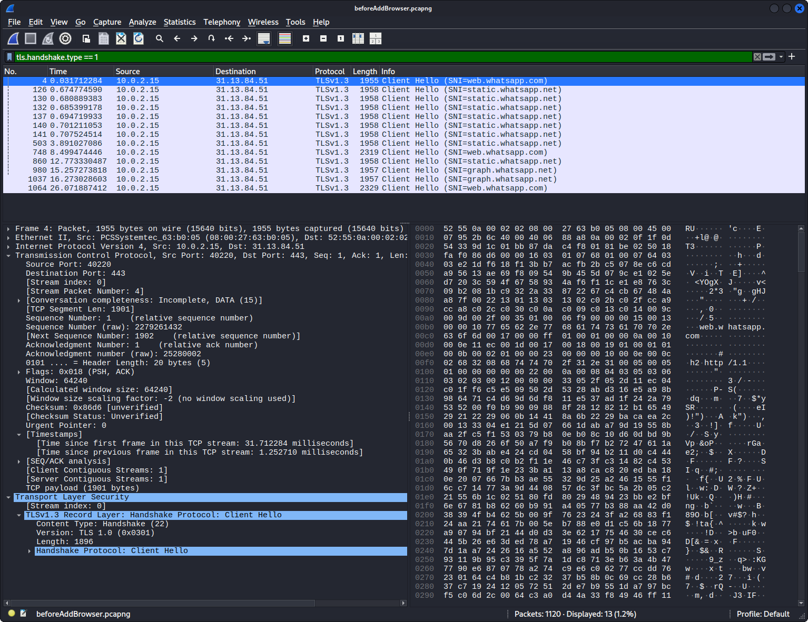

Während der Kopplung wurden weitere TLS Connections aufgebaut:

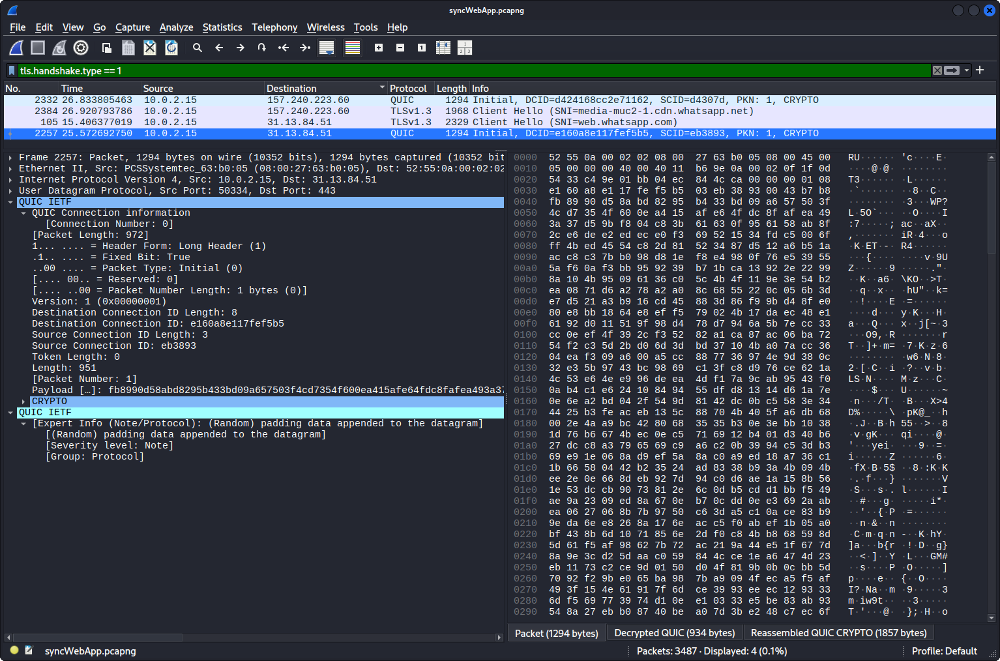

>Können Sie den initialen Schlüsselaustausch bzw. das übertragene Schlüsselmaterial identifizieren (z.B. Signal X3DH, _nicht_ TLS)?
Die mit den WhatsApp Servern ausgetauschten Pakete beschränkten sich auf `QUIC` (Quick UDP Internet Connections) Pakete, `TCP` Handshakes, und `TLS` (Handshake und verschlüsselte Daten). Aus den veschlüsselten `TLS` Paketen konnte der Inhalt nicht abgeleitet werden.

>Können Sie einzelne Nachrichten identifizieren?
>Können Sie unterschiedliche Nachrichten-Typen unterscheiden? (Text, Audio, Telefonat, Medien etc.)

Um Netzwerkverkehr zu erzeugen wurden einige Text Botschaften vom Benutzer an sich selbst geschickt. Aus den übertragenen verschlüsselten TLS Pakten läßt sich nicht ableiten, dass darin Textnachrichten übertragen wurden. Beim Versenden einer Textdatei wurde eine weitere TLS Verbindung zu `media-muc2-1.cdn.whatsapp.net` aufgebaut, ein "Content Delivery Network" server, der möglicherweise in der Umgebung von München steht:

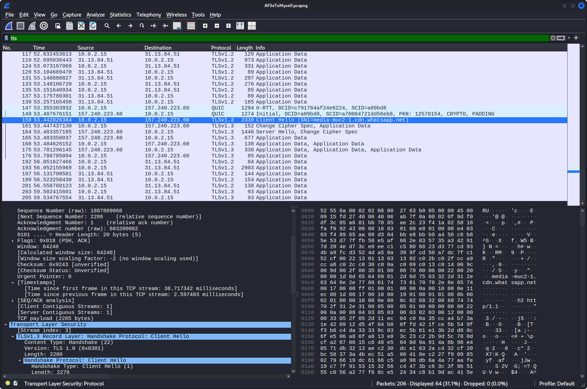

Weder in den verschlüsselten TLS Paketen der neu aufgebauten Verbindung, noch in den Paketen der bereits bestehenden Verbindung konnte der Inhalt der Datei gefunden werden.

>Scheinen interessante Informationen im Netzwerkverkehr auf?
>Welche Metadaten werden übertragen bzw. können Sie Metadaten aus dem aufgezeichneten Netzwerkverkehr entnehmen (z.B. DNS, X.509 Zertifikate)?
>Werden long-term Secrets (Public Keys) als Plaintext übertragen? Oder gibt es Identity Hiding?

Aus den verschlüsselten Daten lassen sich keine Metadaten ableiten.

>Sehen Sie Unterschiede zwischen 1:1 Chats bzw. Group Chats?

Nein, aus den verschlüsselten Daten kann diese Information nicht extrahiert werden.


### Analyse Netzwerktraffic mit Interception

>Sind die Netzwerkverbindungen, zusätzlich zur E2EE, transportverschlüsselt (z.B. TLS)?

Siehe oben, die Pakete sind mit `TLS` transportverschlüsselt.

>Können Sie den TLS-Netzwerkverkehr erfolgreich entschlüsseln?

Mittels `mitmproxy` kann der HTTP Netzwerktraffic (für das Senden einer Textnachricht an den Benutzer selbst im Windows WhatsApp Client) sichtbar gemacht werden.

#### Senden einer Textbotschaft

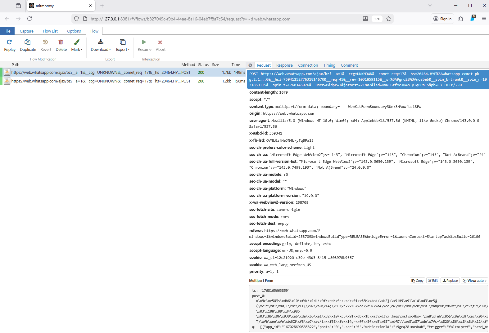

Neben dem HTML Header des `POST` Kommandos wird ein timestamp `ts`, ein verschlüsselter post `post_0` und ein JSON String `q` mit Metadaten mit übertragen:

```json
[{"app_id":"167028690535322","posts":"0","user":"0","webSessionId":":9grq28:nosbab","trigger":"falco:perf","send_method":"ajax","compression":"deflate","snappy_ms":1}]
```

Die Response enthält ein JavaScript, zur Schutz vor script injections. Der darunterliegende JSON Block bestätigt (vermutlich) den Empfang der Textnachricht:

```
for (;
;
);
{
  "__ar":1,"rid":"Akl8PkR8whei-7B9YerTsK7","payload":null,"lid":"7594213701906433384"
}
```

Weder aus Request noch aus dem Response ist der Inhalt der Textnachricht ableitbar.


#### Senden einer Textdatei

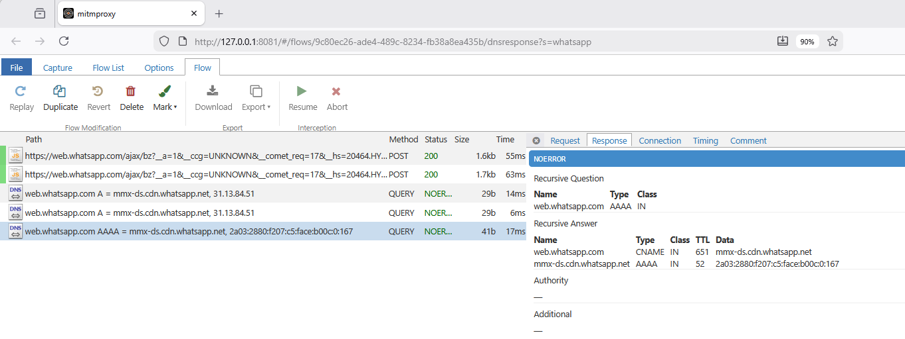

Das Versenden einer Textdatei löst das Versenden von zwei `POST` Kommandos aus, jeweils mit denselben Metadaten im `q` Feld, wie beim Versenden der Textnachricht. Beide Requests enthalten ein verschlüsseltes `post_0` Feld. Die Responses auf die `POST` Requests lauten:

Response 1:
```
for (;
;
);
{
  "__ar":1,"rid":"Ak3xxY6sQMKnHj4UD_ZW0vk","payload":null,"lid":"7594219861673585485"
}
```

Response 2:
```
for (;
;
);
{
  "__ar":1,"rid":"AX_P5F2u8aUW5bVmdwebDre","payload":null,"lid":"7594219937513339975"
}
```

#### Senden eines PDF Dokuments

Während der Übertragung eines größeren .pdf Dokuments (800kB) löst der WhatsApp Client mehrere `POST` Kommandos aus:

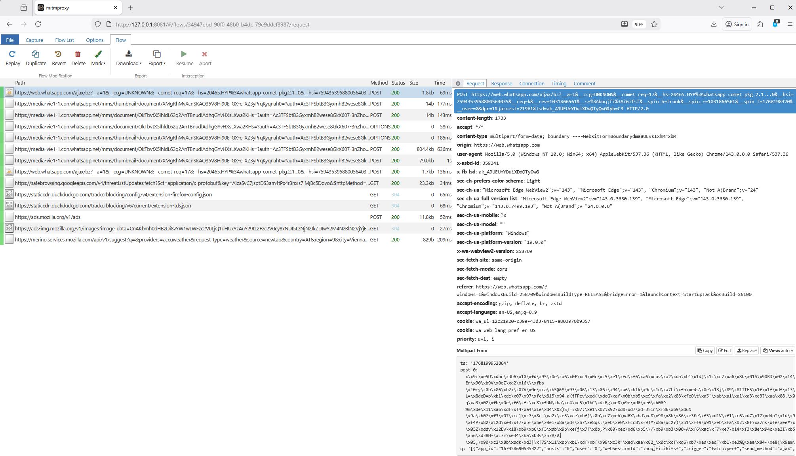

Im `POST` Kommando zu `media-vie1-1.cdn.whatsapp.net` wird die .pdf Datei hochgeladen, der Inhalt der Datei ist verschlüsselt, siehe den Hex Dump unten rechts:

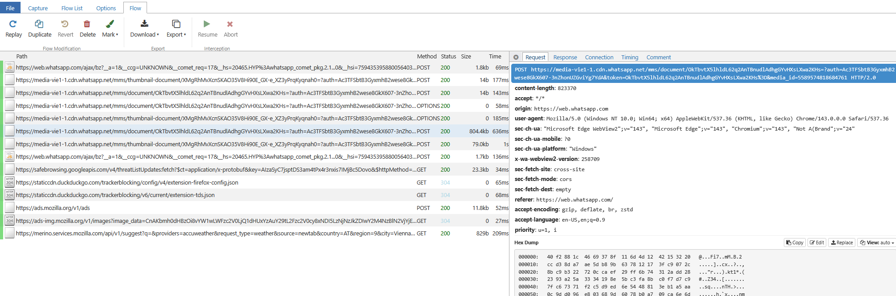

Im Response Paket finden sich die `url` und `direct_path` Meta Daten zum Lokalisieren der hochgeladenen (verschlüsselten) Datei:

```
{
    "url": "https://mmg.whatsapp.net/v/t62.7119-24/615408122_1400781394975311_2522428424940470605_n.enc?ccb=11-4&oh=01_Q5Aa3gE6oseIVEbyAzKhUbVMhwvBiW87-ZK9KT4LfvCCXwMxLA&oe=698C06D6&_nc_sid=5e03e0&mms3=true",
    "direct_path": "/v/t62.7119-24/615408122_1400781394975311_2522428424940470605_n.enc?ccb=11-4&oh=01_Q5Aa3gE6oseIVEbyAzKhUbVMhwvBiW87-ZK9KT4LfvCCXwMxLA&oe=698C06D6&_nc_sid=5e03e0"
}
```` 

Die Übertragung einer ASCII Textdatei (ca 60kB) hat dasselbe Muster ergeben. Der HexDump bestätigt noch einmal, dass die Inhalt der Datei verschlüsselt übertragen werden:

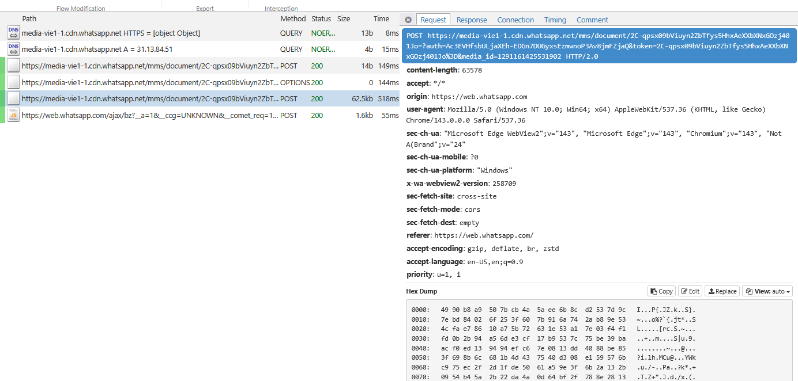

>Können Sie einzelne Nachrichten identifizieren?

Ja, beim Versenden von Textnachrichten können die entsprechenden HTTP `POST` Kommandos zugeordnet werden. Der Inhalt der Textnachrichten ist jedoch weiterhin veschlüsselt.

>Können Sie unterschiedliche Nachrichten-Typen unterscheiden? (Text, Audio, Telefonat, Medien etc.)

Textnachrichten können vom upload von Dateien unterschieden werden, etwa anhand des Domain Names, an den die `POST` Kommandos gehen.

Textnachricht:
```http
POST https://web.whatsapp.com/ajax/bz?__a=...
```

File Upload:
```http
POST https://media-vie1-1.cdn.whatsapp.net/mms/document/JGkrcBNeQc7ixguwy96QX1w9iWqnM-QiI78SFHDMl9s=?auth=...
```

Beim Versenden von Dateien finden sich im `POST` request und im response keine Meta-Daten, die auf den Typ der Datei schließen lassen. Die Größe der hochgeladednen Datei ist allerdings im `POST` Kommando sichtbar.

>Scheinen interessante Informationen im Netzwerkverkehr auf?
Ich konnte aus den Paketen keine Informationen extrahieren, die nicht schon aus den TLS connections ableitbar wären.

>Welche Metadaten werden übertragen bzw. können Sie Metadaten aus dem aufgezeichneten Netzwerkverkehr entnehmen (z.B. DNS, X.509 Zertifikate)?

DNS requests zu den WhatsApp Servern konnten gefunden werden, diese sind jedoch ohnehin nicht verschlüsselt. Aus den WhatsApp Paketen konnte darüber hinaus keine DNS Information extrahiert werden. 

>Werden long-term Secrets (Public Keys) als Plaintext übertragen? Oder gibt es Identity Hiding?

Die Übertragung von Schlüsseldaten konnte aus den Paketen nicht abgeleitet werden.

>Sehen Sie Unterschiede zwischen 1:1 Chats bzw. Group Chats?

Nein, hier sind keine Unterschiede sichtbar.

>Ist Ihnen sonst etwas interessantes/erwähnenswertes aufgefallen?

An einer Stelle hat der WhatsApp Client eine Menge `GET` requests abgesetzt um Icons, ein `pdf-worker` JavaScript file, und einige bootstrap Funktionen nachzuladen. Die Daten in den Requests und Responses waren nicht verschlüsselt:

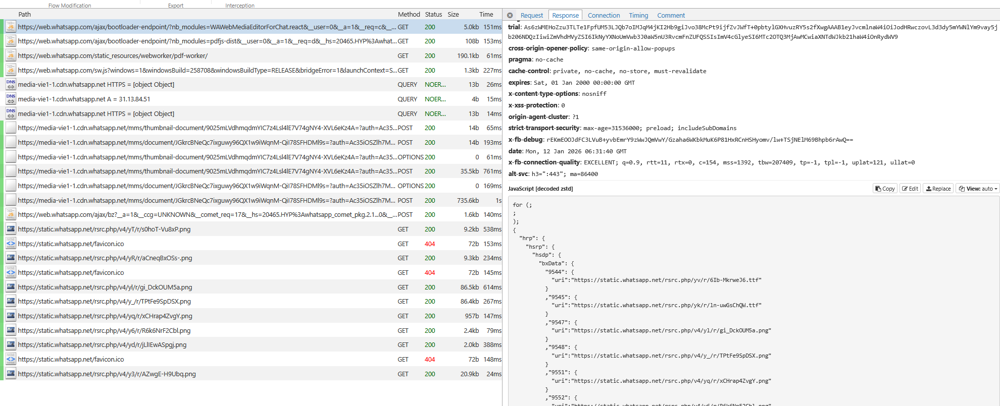
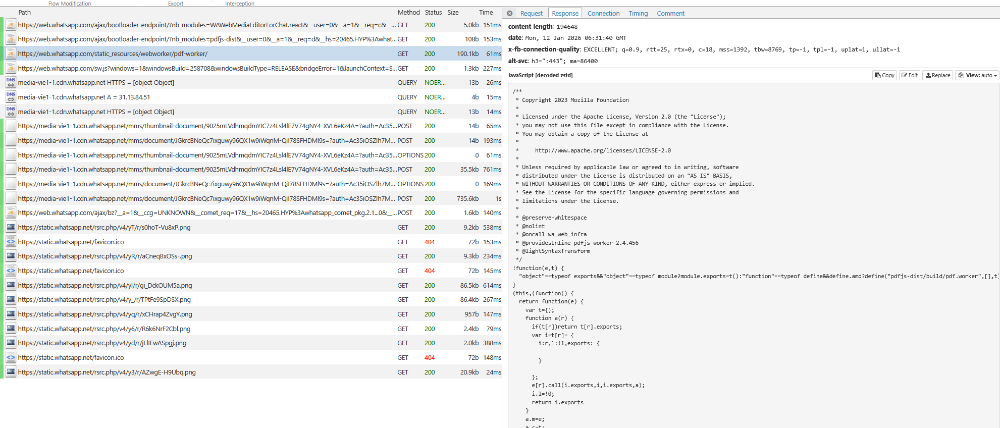
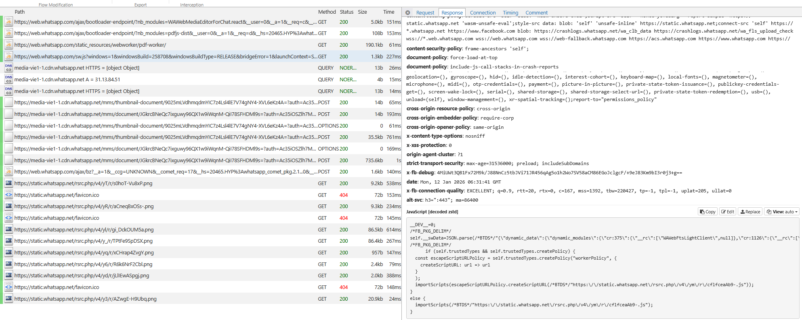


Unterlagen:

    SoK: An Analysis of End-to-End Encryption and Authentication Ceremonies in Secure Messaging Systems
    WhatsApp Security Whitepaper
    Signal: Encrypted Network Traffic Analysis of Secure Instant Messaging Application: A Case Study of Signal Messenger App
    Matrix/Element E2EE Documentation

    Optional:
        Gibt es ein definiertes Threat Model?
        Wo werden long-term Secrets bzw. Key pairs/private Keys abgelegt? Sind diese noch zusätzlich geschützt?
        Hinsichtlich Conversation Security:
            Ist Message/Participation Deniability/Repudiability möglich?
            Ist Forward Secrecy bzw. Backward Secrecy gegeben?
            Ist Key Compromise Impersonation möglich?
    SBA Gegenhuber et al. Papers:
        Preprint Hey there! You are using WhatsApp: Enumerating Three Billion Accounts for Security and Privacy.
        Careless Whisper: Exploiting Silent Delivery Receipts to Monitor Users on Mobile Instant Messengers
        Prekey Pogo: Investigating Security and Privacy Issues in WhatsApp’s Handshake Mechanism

