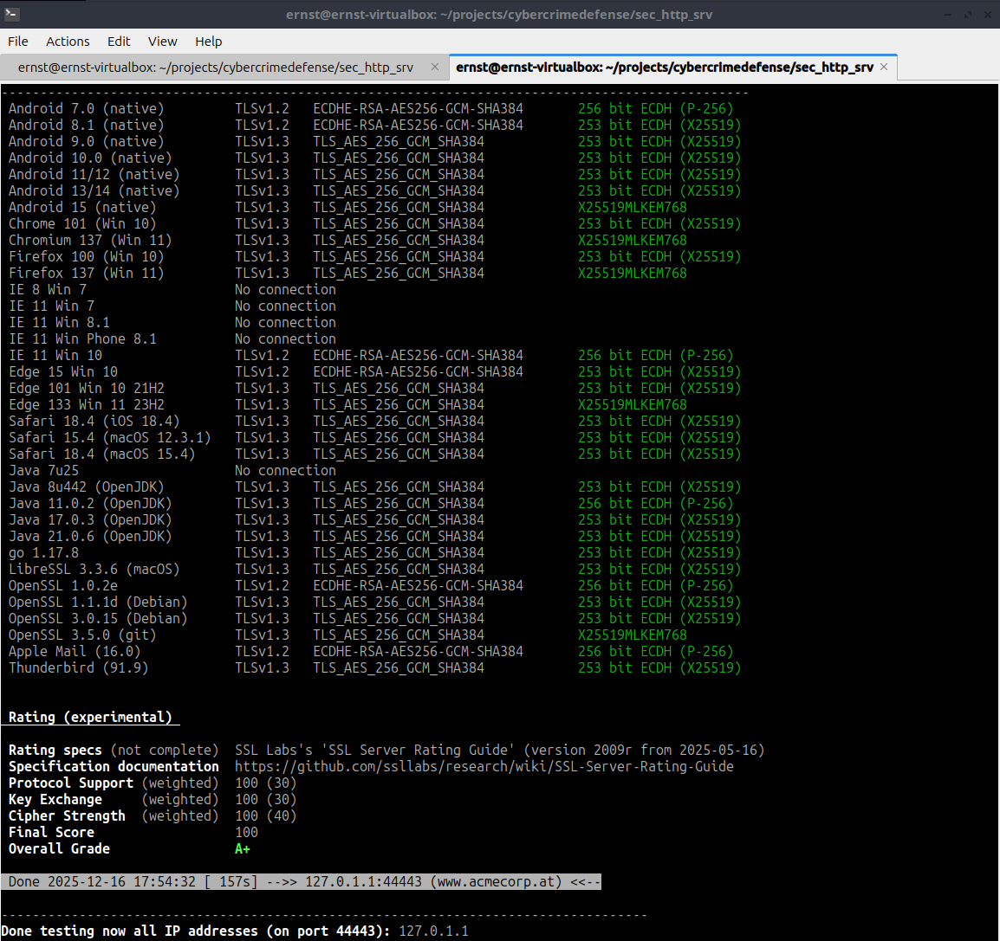

# Secure HTTPS Webserver

Student: Ernst Schwaiger

## Lab Environment

The host system is a Windows 11 notebook, the exercise was conducted in an Lubuntu 24.04 Virtual Box VM, with Docker 28.2.2 installed:

```bash
docker --version
Docker version 28.2.2, build 28.2.2-0ubuntu1~24.04.1
```

The used openssl was manually built and installed `3.0.14`:

```bash
which openssl
/home/ernst/openssl-local/bin/openssl
OpenSSL 3.0.14 4 Jun 2024 (Library: OpenSSL 3.0.14 4 Jun 2024)
```

`docker` has already been installed on the system, the user has been added to the `docker` group.

## Acknowledgment

Stefan Ohnewith provided me with the hint to use `ssl_conf_command` for restricting the TLS 1.3 ciphersuites. Thanks for that :-).

## Creating Keys, Certificates, and Docker Container
>Setzen Sie einen HTTPS Webserver mit nginx auf (z.B. mittels Docker Container).  
>Dieser soll ausschließlich TLS 1.2 und TLS 1.3 unterstützen. Self-signed Zertifikate sind ausreichend.

For the automated creation of all keys and certificates, and for the Docker container a makefile is created. 4096 RSA keys were used for both root and web server certificate. The validity of both certificates was set to a year. `make` creates all keys and certificates, and puts them into the container for the webserver. `make websrv` starts the webserver.

```makefile
IMAGE_NAME=secure-websrv

all: image

image: Dockerfile $(IMAGE_NAME)_cert.pem $(IMAGE_NAME)_key.pem $(IMAGE_NAME)_nginx.conf html/index.html
	docker build -t $(IMAGE_NAME) .

$(IMAGE_NAME)_cert.pem: $(IMAGE_NAME)_csr.cnf
	# Web server key and certificate
	openssl genrsa -out root_key.pem 4096
	openssl req -new -key $(IMAGE_NAME)_key.pem -out $(IMAGE_NAME)_csr.pem -config $(IMAGE_NAME)_csr.cnf
	# Sign Web server certificate
	openssl x509 -req -in $(IMAGE_NAME)_csr.pem -CA root_cert.pem -CAkey root_key.pem -CAcreateserial -out $(IMAGE_NAME)_cert.pem -days 365 -extensions v3_req -extfile $(IMAGE_NAME)_csr.cnf

# root key
root_key.pem:
	openssl genrsa -out root_key.pem 4096

# root certificate
root_cert.pem: root_key.pem
	openssl req -x509 -new -nodes -key root_key.pem -sha256 -days 365 -out root_cert.pem

# Web server key
$(IMAGE_NAME)_key.pem:
	openssl genrsa -out $(IMAGE_NAME)_key.pem 4096

# Certificate signing request
$(IMAGE_NAME)_csr.pem: $(IMAGE_NAME)_key.pem $(IMAGE_NAME)_csr.cnf
	openssl req -new -key $(IMAGE_NAME)_key.pem -out $(IMAGE_NAME)_csr.pem -config $(IMAGE_NAME)_csr.cnf

# Web server certificate 
$(IMAGE_NAME)_cert.pem: $(IMAGE_NAME)_csr.pem root_cert.pem root_key.pem $(IMAGE_NAME)_csr.cnf
	openssl x509 -req -in $(IMAGE_NAME)_csr.pem -CA root_cert.pem -CAkey root_key.pem -CAcreateserial -out $(IMAGE_NAME)_cert.pem -days 80 -extensions v3_req -extfile $(IMAGE_NAME)_csr.cnf

# Run the webserver
websrv:
	docker run -p 44443:443 $(IMAGE_NAME)
```

The configuration for the webservers certificate is contained in `secure-websrv_csr.cnf`:

```
[req]
distinguished_name = req_distinguished_name
req_extensions = v3_req

[req_distinguished_name]
CN = www.acmecorp.at

[v3_req]
subjectAltName = @alt_names

[alt_names]
DNS.1 = www.acmecorp.at
DNS.2 = acmecorp.at
```

As the distinguished name of the certificate refers to `www.acmecorp.at`, an entry needs to be made in `etc/hosts` to map it to `127.0.0.1`.

```
# Standard host addresses
# ...
# acmecorp address
127.0.1.1  www.acmecorp.at
```

The Dockerfile for creating the webserver:
```Dockerfile
# Most recent nginx tag on dockerhub
FROM nginx:mainline-alpine3.23-perl

# config files, keys, certs, web content
COPY ./secure-websrv_nginx.conf /etc/nginx/nginx.conf
COPY ./secure-websrv_key.pem /etc/nginx/secure-websrv_key.pem
COPY ./secure-websrv_cert.pem /etc/nginx/secure-websrv_cert.pem
COPY ./html /usr/share/nginx/html

# Expose HTTPS 443
EXPOSE 443

# Run Nginx in the foreground
CMD ["nginx", "-g", "daemon off;"]
```

The webservers minimal landing page:
```html
<!DOCTYPE html>
<html lang="en">
<head>
    <meta charset="UTF-8">
    <meta name="viewport" content="width=device-width, initial-scale=1.0">
    <title>Hello, World</title>
</head>
<body>
    <h1>Hello, World!</h1>
</body>
</html>
```

A basic NGINX configuration `secure-websrv_nginx.conf` file to start from is created:

```nginx.conf
user  nginx;
worker_processes  auto;

events {
    worker_connections 1024;
}

http {
    include       /etc/nginx/mime.types;
    default_type  application/octet-stream;

    sendfile        on;
    keepalive_timeout  65;

    server {
        listen              443 ssl;
        server_name         www.acmecorp.at;
        ssl_certificate     secure-websrv_cert.pem;
        ssl_certificate_key secure-websrv_key.pem;
        
        # Only allow TLS V1.2 and V1.3
        ssl_protocols       TLSv1.2 TLSv1.3;

        location / {
            root   /usr/share/nginx/html;
            index  index.html index.htm;
        }

        error_page  500 502 503 504 /50x.html;
        location = /50x.html {
            root /usr/share/nginx/html;
        }
    }
}
```

## Launch Webserver, Display Page in Browser

Running `make && make websrv` generates all dependencies and launches the server. In order to see the website in a browser, the certificate `root_cert.pem` is installed upfront, then `https://www.acmecorp.at:44443/` can be accessed:


## Fix testssl.sh findings
>Testen Sie Ihren Webserver mit testssl.sh (Website, GitHub). testssl.sh führt ein Rating anhand des "SSL Labs's SSL Server Rating Guide" durch (Anm.: testssl.sh wird auch von Ivan Ristic empfohlen).  
>Das Ziel dieser Übung ist es, einen "Final Score" von 100 erreichen (= "Flag").  
>Die Übung haben Sie erfolgreich abgeschlossen, wenn  
>- Ihr Webserver ausschließlich TLS 1.2 und TLS 1.3 unterstützt  
>- TLS Session Tickets deaktiviert sind   
>- Sie nur "grüne" Ausgaben von testssl.sh haben...  
>- Ausnahmen:  
>   - Hinsichtlich (self-signed) Zertifikat: SAN, Trust, OCSP  
>   - DNS CAA RR 

testssl is installed by checking out the repo `https://github.com/testssl/testssl.sh` as suggested in their README:

```bash
git clone --depth 1 https://github.com/testssl/testssl.sh.git --branch 3.3dev
```

running `../testssl.sh/testssl.sh --add-ca ~/projects/cybercrimedefense/sec_http_srv/root_cert.pem www.acmecorp.at:44443` yields the following issues:

```
Obsoleted CBC ciphers (AES, ARIA etc.)            offered
TLSv1.2 (no server order, thus listed by strength)
Has server cipher order?     no (NOT ok)
Session Resumption           tickets: yes, ID: no

OCSP URI                     --
                              NOT ok -- neither CRL nor OCSP URI provided
DNS CAA RR (experimental)    not offered
Strict Transport Security    not offered
Server banner                nginx/1.29.4
Security headers             --

LUCKY13 (CVE-2013-0169), experimental     potentially VULNERABLE, uses cipher block chaining (CBC) ciphers with TLS. Check patches
```

The issues concerning `OSCP` and `DNS CAA RR` can be ignored. In the first step, 
- a list of cipher suites is selected, demanding the configured order from the server.
- Strict Transport Security is required, security headers are added
- TLS Session Tickets are deactivated

The list of ciphersuites is taken from `https://wiki.mozilla.org/Security/Server_Side_TLS`, from the *Intermediate* configuration.

```
# Disable TLS session tickets
ssl_session_tickets off;

# Ensure the server’s cipher suite preference is used
ssl_prefer_server_ciphers on;         

# Ordered list of supported TLS ciphers       
ssl_ciphers 'ECDHE-RSA-AES256-GCM-SHA384:ECDHE-RSA-AES256-SHA384:ECDHE-RSA-AES256-SHA:ECDHE-RSA-CHACHA20-POLY1305:ECDHE-RSA-CAMELLIA256-SHA384:ECDHE-ARIA256-GCM-SHA384:ECDHE-RSA-AES128-GCM-SHA256:ECDHE-RSA-AES128-SHA256:ECDHE-RSA-AES128-SHA:ECDHE-RSA-CAMELLIA128-SHA256:ECDHE-ARIA128-GCM-SHA256';

# headers options  for security, let the browser remember for a year that
# it should access the server via HTTPS
add_header Strict-Transport-Security "max-age=31536000; includeSubDomains" always;
# prevent our site from being used in clickjacking attacks
add_header X-Frame-Options "SAMEORIGIN";
# block site from XSS attacks
add_header X-XSS-Protection "1; mode=block";
# prevent browsers from sniffing
add_header X-Content-Type-Options "nosniff";
```

Rebuilding the webserver, running `testssl.sh` again, yields (ignoring `OSCP` and `DNS CAA RR`):

```
 Server banner                nginx/1.29.4
```

In the next step, the `version number the server returns is removed and the ciphersuites are reduced to avoid CBC:

```
    # turn server tokens off
    server_tokens off;
```

This fixes the server banner issue. However, the `Final Score` of the configuration is `96/100`. The output of `testssl.sh` indicates that for TLS 1.2 and TLS 1.3, still ciphersuites can be used with 128 bit symmetric keys:

```
TLSv1.2 (server order)
 xc02f   ECDHE-RSA-AES128-GCM-SHA256       ECDH 253   AESGCM      128      TLS_ECDHE_RSA_WITH_AES_128_GCM_SHA256              
 xc030   ECDHE-RSA-AES256-GCM-SHA384       ECDH 253   AESGCM      256      TLS_ECDHE_RSA_WITH_AES_256_GCM_SHA384              
 xcca8   ECDHE-RSA-CHACHA20-POLY1305       ECDH 253   ChaCha20    256      TLS_ECDHE_RSA_WITH_CHACHA20_POLY1305_SHA256        
TLSv1.3 (server order)
 x1302   TLS_AES_256_GCM_SHA384            ECDH/MLKEM AESGCM      256      TLS_AES_256_GCM_SHA384                             
 x1303   TLS_CHACHA20_POLY1305_SHA256      ECDH/MLKEM ChaCha20    256      TLS_CHACHA20_POLY1305_SHA256                      
```

The weaker TLS 1.2 ciphersuites can be removed in `ssl_ciphers`, as of now, TLS 1.3 ciphersuites can only be configured using the `ssl_conf_command` directive in the NGINX configuration file. By explicitly only providing the stronger ciphersuites, we get a score of `100`.

```
# Ordered list of supported TLS 1.2 ciphers
ssl_ciphers 'ECDHE-RSA-AES256-GCM-SHA384:ECDHE-RSA-CHACHA20-POLY1305';

# Ordered list of supported 1.3 ciphers, see
# https://github.com/mozilla/ssl-config-generator/issues/124        
ssl_conf_command Ciphersuites TLS_AES_256_GCM_SHA384:TLS_CHACHA20_POLY1305_SHA256;
```



## Resources used

- https://nginx.org/en/docs/http/configuring_https_servers.html
- https://github.com/mozilla/ssl-config-generator/issues/124 
- https://wiki.mozilla.org/Security/Server_Side_TLS

